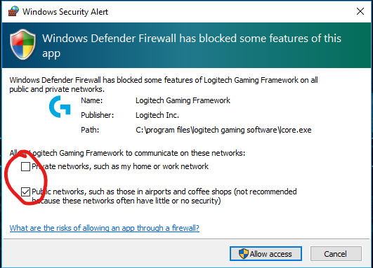
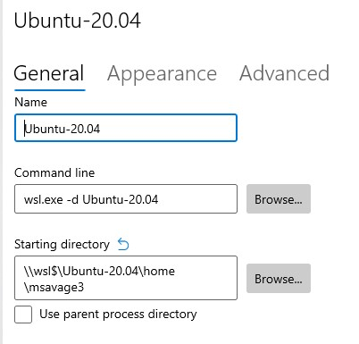
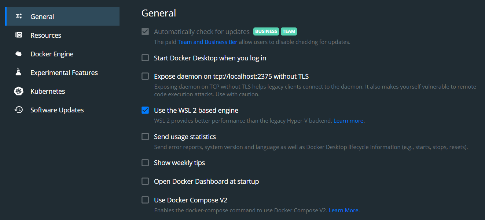
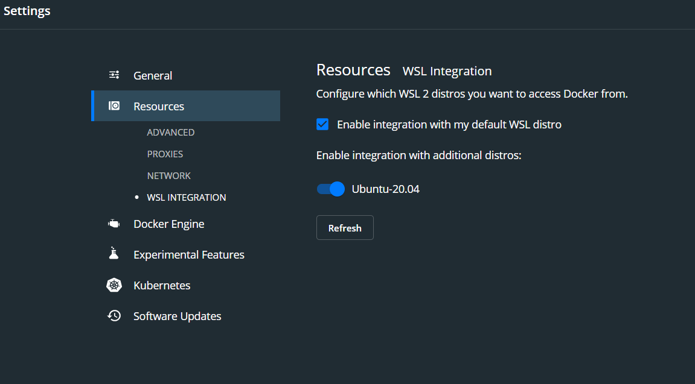
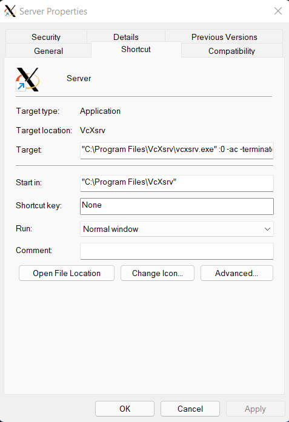
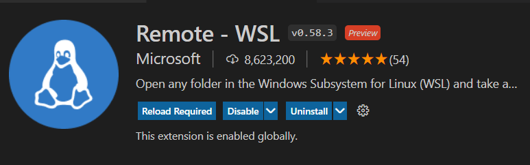
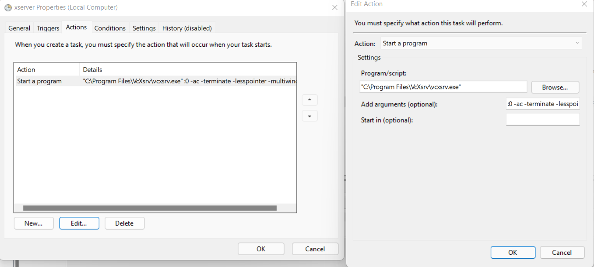
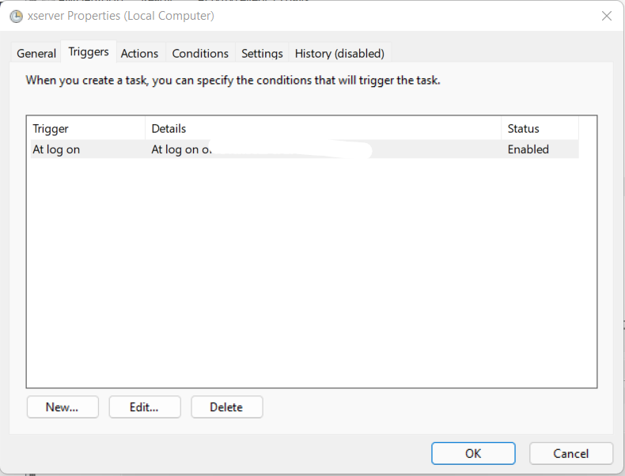
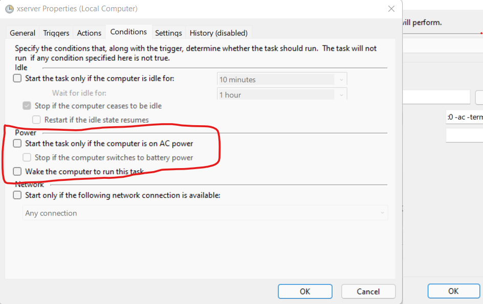

# WSL2 Guide on Windows 10

WSL2 will enable you to use the linux sub system on Windows 10. This should also work on Windows 11.

# Notes before starting

If you ever get firewall notifications for either Docker, Ubuntu, any other applications that you install, it's important to tick both of these boxes and allow access

<div align="center">
    
</div>

Its important you learn the following as we will be referring  to these terms often.
 
- WSL2 stands for Windows Subsystem for Linux. Always use version 2. It lets you use Linux operating systems such as ubuntu as close to native as possible. https://en.wikipedia.org/wiki/Windows_Subsystem_for_Linux
- Display Servers enable you to run GUI apps from a Linux shell. https://en.wikipedia.org/wiki/Windowing_system#Display_server
- Windows 11 Wayland is one implementation of a Display Server. It comes packaged with Windows 11. Windows 10 does not, therefore the `DISPLAY` export isn't needed but you can override this if you wish to use your own X Server if you are on Windows 11.
- Its recommended you run Intellij from within wsl2 to get a more native Linux experience. It also indexes faster. 
- Use ~/.bashrc if your using bash or ~/.zshrc for zsh users.
- Modern operating systems use 64 bit apps to make use of more then 4gb of ram. Remember x86 is the same as 32bit. Try and use 64bit applications where possible. In a windows title bar if its blank it is usually 64bit(if you are running a 64bit Windows 10), ensure it doesnt say x86 especially for powershell.

# Pre-requisites 
- WSL 2 is only available in Windows 10, Version 1903, Build 18362 or higher.

## Install WSL2

---

### **NOTE: Use Powershell as Admin (64 bit not x86).**

Install Chocolatey, a package manager by running the following: - [More Info Here](https://chocolatey.org/install)
```
Set-ExecutionPolicy Bypass -Scope Process -Force; [System.Net.ServicePointManager]::SecurityProtocol = [System.Net.ServicePointManager]::SecurityProtocol -bor 3072; iex ((New-Object System.Net.WebClient).DownloadString('https://chocolatey.org/install.ps1'))
```

Install WSL - [More Info Here](https://docs.microsoft.com/en-us/windows/wsl/install)

```
wsl --install
```
Install the recommended Ubuntu distro, Ubuntu 2004. You can check the available distros too.
```
wsl --list –online 
```
```
wsl --install –d ubuntu-20.04 
```

---

## Setup Ubuntu 

Once ubuntu-2004 is installed run it from your start menu and follow the instructions - [More Info Here](https://docs.microsoft.com/en-us/windows/wsl/install#set-up-and-best-practices)  

- If wsl2kernel issues appear then Download the Linux kernel update package, [wsl_update_x64.msi](https://docs.microsoft.com/en-gb/windows/wsl/install-manual#step-4---download-the-linux-kernel-update-package)

- Set username and password

---
## Setup Microsoft Terminal

Microsoft Terminal is very useful for switching between Powershell, CMD, and Ubuntu.
```
choco install microsoft-windows-terminal
```

Open Windows Terminal and use Ubuntu image. 
- Go to Settings --> Startup --> Default profile --> Ubuntu-20.04 

Change the command for opening Ubuntu in case of errors.  
- Go to Settings --> Profiles --> Ubuntu-20.04 
- Enter `wsl.exe -d Ubuntu-20.04`

Change starting directory of Windows Terminal
- Go to Settings --> Profiles --> Ubuntu-20.04
- Enter `\\wsl$\Ubuntu-20.04\home\YOURUSERNAME`

<div align="center">
    
</div>

## Using WSL2

--> **NOTE: Use Windows Terminal From Here On** <--

Update the ubuntu packages 
```
sudo apt-get update –y 
```

Then install zipping tools, zip and unzip - https://zoomadmin.com/HowToInstall/UbuntuPackage/unzip 

```
sudo apt-get install -y zip unzip
```

Install some basic packages. These are more than likely already installed, but it’s best to be sure. 
```
sudo apt-get install build-essential curl file git zsh xclip 
```
- curl is used to transfer data from a server.
- zsh will be used for ohmyzsh
- xclip will be used for copying SSH Keys

## Install Ohmyzsh! - A better command-line Terminal (Skip if you want to stcik with bash)

Install Ohmyzsh - [More Info Here](https://ohmyz.sh/)
```
sh -c "$(curl -fsSL https://raw.github.com/ohmyzsh/ohmyzsh/master/tools/install.sh)" 
```

Zsh-autosuggestions plugin - [More Info Here](https://github.com/zsh-users/zsh-autosuggestions/blob/master/INSTALL.md#oh-my-zsh)
```
git clone https://github.com/zsh-users/zsh-autosuggestions ${ZSH_CUSTOM:-~/.oh-my-zsh/custom}/plugins/zsh-autosuggestions 
```

Open .zshrc file by entering 'cd' then entering `nano ~/.zshrc`. Overwrite plugins in the file so it is now: 
```
plugins=(  
    git
    zsh-autosuggestions 
) 
```

## Install SDKMan, a Java package manager

Install SDKMan - [More Info Here]( https://sdkman.io/install)
```
curl -s "https://get.sdkman.io" | bash
```
```
source "$HOME/.sdkman/bin/sdkman-init.sh"
```

Install Java 11 using SDKMan
```
sdk list java
```
```
sdk install java 11.0.11.hs-adpt
```
```
java --version
```

## Install Homebrew as it's useful for installing things like Maven. Homebrew is not just for mac!
Install homebrew - [More Info Here]( https://www.osradar.com/install-homebrew-ubuntu-20-04-debian-10/)
```
/bin/bash -c "$(curl -fsSL https://raw.githubusercontent.com/Homebrew/install/master/install.sh)" 
```

In the Terminal, the following message will be printed. Execute  the commands as suggested. 
```
Next steps: 

- Run these two commands in your terminal to add Homebrew to your PATH: 

    echo 'eval "$(/home/linuxbrew/.linuxbrew/bin/brew shellenv)"' >> /home/nkumar40/.profile 

    eval "$(/home/linuxbrew/.linuxbrew/bin/brew shellenv)" 

- Install Homebrew's dependencies if you have sudo access: 

    sudo apt-get install build-essential 

  For more information, see: 

    https://docs.brew.sh/Homebrew-on-Linux 

- We recommend that you install GCC: 

    brew install gcc 
```

Install Maven - [More Info Here](https://formulae.brew.sh/formula/maven)
```
brew install maven
```
```
mvn --version
```

## Install Docker 
If you have a docker license or are using docker for non-commericial purposes Docker Desktop is quite easy to setup
https://docs.docker.com/desktop/windows/install/


Tick all boxes for any firewall Windows for this application

<div align="center">
    
    
</div>


Restart Windows Terminal and test Docker via the following commands
```
docker run -it hello-world
```
```
docker ps
```

### Alternative Docker via Rancher Desktop (Open Source)
1. Download Docker Rancher for Windows from https://rancherdesktop.io/
2. During setup disable "Enable Kubernetes" and select dockerd(moby)
3. Enable Ubuntu distro via File -> Preferences 
4. Run the below commands to fix any errors (note you may need to restart your machine)

```
sudo apt install libsecret-1-0
docker-credential-secretservice version
docker login
docker run -it hello-world
```

## WSLG Apps
We can use a display server to run GUI apps. For testing purposes we will be using Gedit (Text Editor) and Nautilus (file explorer)

- Install your display server from https://sourceforge.net/projects/vcxsrv/
- Create a Windows shortcut to point to your display server. You can use the one [inside the scripts folder](/scripts/shortcut.zip).
- Unzip the file to your Desktop, for future convenience.
- By running this, it should run your display server in background. 
- Tick all boxes for any firewall windows for this application

--- 
### WSLG Manual Setup

**--> SKIP THIS SECTION IF YOU USED THE SCRIPT ABOVE <--**  
The script is set up with the below arguments. 

<div align="center">
    
</div>

```
"C:\Program Files\VcXsrv\vcxsrv.exe" :0 -ac -terminate -lesspointer -multiwindow -clipboard -wgl -swcursor -dpi 144
```
**--> SECTION OVER <--** 

--- 

### WSLG Apps

Install GUI apps and run them. You can use Ctrl+Z/Ctrl+C to exit them within terminal if they do not shut down properly. The DISPLAY export lets you open these programs in a GUI.

Store the below in your .bashrc or .zshrc file. This will point to the display server(VcXsrv)

To open .zshrc file, enter `nano ~/.zshrc`:
```
export DISPLAY=$(grep -m 1 nameserver /etc/resolv.conf | awk '{print $2}'):0.0
```

```
sudo apt install nautilus gedit
```

Check they are installed by running:
```
nautilus
```
```
gedit
```

You can now edit files `gedit` and view files with `nautilus`

## Install NVM (Manager for Nodejs and NPM) - [More Info Here](https://linuxize.com/post/how-to-install-node-js-on-ubuntu-20-04/#installing-nodejs-and-npm-using-nvm)

Install nvm  
```
curl -o- https://raw.githubusercontent.com/nvm-sh/nvm/v0.35.3/install.sh | bash 
```

Open .zshrc file, enter `gedit ~/.zshrc` and add the following to the file: 

```
export NVM_DIR="$HOME/.nvm" 
[ -s "$NVM_DIR/nvm.sh" ] && \. "$NVM_DIR/nvm.sh" # This loads nvm 
[ -s "$NVM_DIR/bash_completion" ] && \. "$NVM_DIR/bash_completion" # This loads nvm bash_completion 
```

## Install Google Chrome

Dependencies, make sure you’re up to date first:

```
sudo apt update && sudo apt -y upgrade && sudo apt -y autoremove
```

Download and install Chrome:

```
wget https://dl.google.com/linux/direct/google-chrome-stable_current_amd64.deb
```
```
sudo apt -y install ./google-chrome-stable_current_amd64.deb
```

Check that it’s installed ok:

```
google-chrome --version
```

Done! Now it can be used either from the command line `google-chrome`.

## Install Intellij

Install Intellij on Ubuntu using Snap. - [More Info Here](https://www.jetbrains.com/idea/download/?fromIDE=#section=linux)
```
cd
```
```
mkdir scripts
```
```
cd scripts
```

Get the latest Intellij download from here. 

For Intellij Community users (Free)
```
wget https://download.jetbrains.com/idea/ideaIC-2021.3.2.tar.gz
```
```
tar -zxf ideaIC-2021.3.2.tar.gz
```

For Intellij Ultimate users (Paid)
```
wget https://download.jetbrains.com/idea/ideaIU-2021.3.2.tar.gz
```
```
tar -zxf ideaIU-2021.3.2.tar.gz
```
Ensure you add your libraries on your Ubuntu shell, for things like fonts etc
```
sudo apt install libcups2 libpangocairo-1.0-0 libatk-adaptor libxss1 libnss3 libxcb-keysyms1 x11-apps libgbm1
```

For covenience, create an alias to run this via one of the below commands. Use the correct path. Store this in either the `.bashrc`  or `.zshrc`. To open .zshrc file, enter `gedit ~/.zshrc`:
```
export LIBGL_ALWAYS_INDIRECT=1
```
```
function idea() {
    /home/mohim/tools/apps/idea/idea-IU-222.3345.118/bin/idea.sh "$1" > /dev/null 2>&1 &
}
```

Then you can run `idea` in your ubuntu terminal

## Integration with VS Code
VS Code probably has the best integration with wsl2. 
- Install VS Code - https://code.visualstudio.com/
- Install the plugin for WSL2

<div align="center">
    
</div>

Then if you restart your pc/terminal you can run `code dir` within the windows terminal and it will open up your folders/files in vs code code.

## Running the Display server as a task when you log in
If you don't want to run the display server every time you start your pc you can setup a basic task

Open up task scheduler from the start menu. Add a basic task with these instructions and arguments. This will run every time you log in. Its import to untick the boxes in red even they are greyed out.

<div align="center">
    
    
    
</div>

## Open windows explorer via Microsoft Terminal

Add the following alias to your .bashrc or .zshrc. Then you can use `open dir` to open a specific directory in windows file explorer.

To open .zshrc file, enter `gedit ~/.zshrc`:
```
alias open="explorer.exe"
```

# Troubleshooting
This part will cover any issues you have


## WSL2 Not starting on bootup
If you have issues running wsl2 on bootup then you can disable fastboot. https://stephenreescarter.net/wsl2-network-issues-and-win-10-fast-start-up

## WSL2 Internet issues with vpn 
Use CMD or postman/internet browser for vpn related requests. For now the vpn isn't compatible with the ubuntu terminal. There are alternatives that you can do by editing the /etc/resolv.conf file but this only works with some corporate vpns.  

## Intellij not starting
- Check your $DISPLAY variable to ensure it points to the WSL2 
- Check you are running VcXsrv. The shortcut is inside the scripts folder within a zip file. I hardly advise you set it up in a task so it auto starts on login.

# Intellij has missing icons and fonts

Go to help > Edit Custom VM options on intellij and add the following line
```
-Dremote.x11.workaround=false
```

## Intellij looks blurry
Only do these steps if your intelliJ looks blurry. I had the same issue on a 4k monitor.
1. Right click the following files and go to properties -> compatibility > Change high DPI Scaling > High DPI Scaling override Application
```
C:\Program Files\VcXsrv\vcxsrv.exe
C:\Program Files\VcXsrv\xlaunch.exe
```

Then you can add the following to your .bashrc or .zshrc file. This profile works for me on a 4k monitor with 175% windows display scaling. Note only do the below if you have a 4k monitor. The numbers may change.
To open .zshrc file, enter `gedit ~/.zshrc`:

```
export GDK_SCALE=2
export GDK_DPI_SCALE=0.75
export QT_SCALE_FACTOR=2
```

## Scrolling in nano via mouse
Add the following alias to your .bashrc or .zshrc. Reload this in your terminal using source ~/.bashrc.
To open .zshrc file, enter `gedit ~/.zshrc`:
```
alias nano="nano --mouse"
```

# TODO

- Add more wsl2 tips from existing files
- paste images and files to intellij and nautilus
- Map wsl2 as a network drive for easy exploring within file explorer
- get rid of scaling errors with nautilus
- how to shortcut intellij on desktop from wsl2
